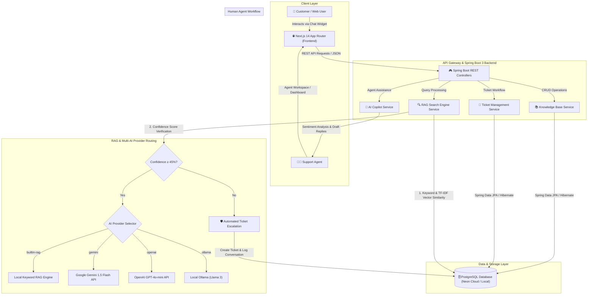

# 🤖 NexusAI Customer Support & Enterprise RAG Platform

[](https://spring.io/projects/spring-boot)
[](https://nextjs.org/)
[](https://www.typescriptlang.org/)
[](https://www.postgresql.org/)
[](LICENSE)

> An end-to-end, enterprise-grade **AI Customer Support Automation & Agent Copilot Platform** powered by **Spring Boot 3**, **Next.js 14**, **PostgreSQL**, and flexible **Multi-Provider AI (Google Gemini, OpenAI, Ollama & Built-in RAG)**.

🌐 **Live Application**: [https://ai-customer-support-app-tawny.vercel.app](https://ai-customer-support-app-tawny.vercel.app/)  
📁 **GitHub Repository**: [https://github.com/Sivatheevan1224/ai-customer-support-app](https://github.com/Sivatheevan1224/ai-customer-support-app)

---

## 📋 Executive Overview

**NexusAI** bridges customer self-service and human agent workflows into a unified, intelligent support platform. It automatically resolves customer inquiries in real time using **Retrieval-Augmented Generation (RAG)** grounded directly in your organization's Knowledge Base articles. 

When customer queries fall below confidence thresholds, the system seamlessly triggers **Automated Ticket Escalation** to live human agents. Human agents are then empowered by an **AI Copilot** that analyzes ticket sentiment, suggests priority levels, and generates 1-click draft responses.

---

## 🏛️ System Architecture



---

## ✨ Key Features

### 1. 🤖 Embeddable AI Customer Support Widget
* **Real-time RAG Answers**: Delivers instant, accurate answers based on published Knowledge Base articles with source citations and confidence scores.
* **Conversational Intent Handling**: Smart resolution of general greetings, identity questions, and small-talk queries with high confidence.
* **Automated Ticket Escalation**: If an inquiry scores below a 45% confidence threshold, the bot gracefully informs the customer and creates a support ticket in PostgreSQL.
* **Session Persistence**: Chat history persists across page reloads in `localStorage` with a 1-click clear action.

### 2. 🧠 Human Agent Workspace & AI Copilot
* **Customer Sentiment Analysis**: Automatically detects customer emotional tone (`FRUSTRATED`, `URGENT`, `NEUTRAL`) from support messages.
* **AI Priority Suggestion**: Evaluates ticket severity and suggests appropriate priority (`HIGH`, `MEDIUM`, `LOW`).
* **1-Click AI Draft Replies**: Generates context-aware response drafts that support agents can edit and submit instantly.
* **Complete Ticket Lifecycle**: Filter tickets by status (`OPEN`, `IN_PROGRESS`, `RESOLVED`, `CLOSED`), update priorities, and delete resolved tickets.

### 3. 📚 Knowledge Base Management Engine
* **Article Publishing & Categorization**: Full CRUD interface for article management across categories (Billing, Technical, Account, Shipping, General).
* **Helpfulness Voting**: Collects user feedback (`helpful` vs `unhelpful` counts) to track documentation quality.
* **Instant Article Deletion**: Full deletion support with confirmational modals on both grid cards and detail views.

### 4. 📊 System Analytics Dashboard
* **Telemetry Metrics**: Tracks key performance indicators including **Deflection Rate**, **CSAT Score**, **Average Resolution Time**, and **Total Deflected Queries**.
* **Interactive Visualizations**: Clean charts rendering ticket volume, category distribution, and AI efficiency trends.

---

## 🛠️ Technology Stack

| Layer | Component | Description |
| :--- | :--- | :--- |
| **Frontend** | [Next.js 14](https://nextjs.org/) | React Framework (App Router, Server & Client Components) |
| | [TypeScript](https://www.typescriptlang.org/) | Type-safe application development |
| | [Tailwind CSS](https://tailwindcss.com/) | Modern UI styling, dark mode, glassmorphism design |
| | [Lucide React](https://lucide.dev/) | Clean UI icons |
| **Backend** | Java 17 | Core programming language |
| | [Spring Boot 3.2](https://spring.io/projects/spring-boot) | REST API framework, JPA, Hibernate |
| | [Lombok](https://projectlombok.org/) | Boilerplate reduction for Java models |
| **Database** | [PostgreSQL 16](https://www.postgresql.org/) | Relational database (Local or Neon Cloud PostgreSQL) |
| **AI Integration**| Google Gemini API | `gemini-1.5-flash` model integration |
| | OpenAI API | `gpt-4o-mini` model support |
| | Ollama | Local LLM hosting (`llama3`, `mistral`) |
| | Built-in RAG Engine | Zero-key fallback text processing & similarity matching |
| **DevOps & Containers** | Docker & Docker Compose | Containerized multi-stage deployments |

---

## 📂 Project Directory Structure

```
ai-customer-support-app/
├── backend/                        # Spring Boot 3 Java Backend
│   ├── src/main/java/com/support/ai/
│   │   ├── config/                 # CORS & Security Configurations
│   │   ├── controller/             # REST Endpoints (AI, Tickets, Knowledge, Analytics)
│   │   ├── model/                  # JPA Entities (Ticket, KnowledgeArticle, TicketMessage)
│   │   ├── repository/             # Spring Data JPA Repositories
│   │   └── service/                # Business Logic (RAG Engine, AI Copilot, KB, Tickets)
│   ├── .env.example                # Backend Environment Template
│   ├── Dockerfile                  # Maven & Java JRE Docker build file
│   └── pom.xml                     # Maven Dependencies
│
├── frontend/                       # Next.js 14 React Frontend
│   ├── src/
│   │   ├── app/                    # Next.js App Router Pages
│   │   │   ├── knowledge/          # Knowledge Base Management Page
│   │   │   ├── tickets/            # Agent Workspace & Copilot Page
│   │   │   ├── widget-demo/        # Standalone Customer Chat Widget Page
│   │   │   ├── page.tsx            # Main Analytics & System Dashboard
│   │   │   └── layout.tsx          # Global Navigation & Layout Container
│   │   └── components/             # Reusable UI Components & Modals
│   ├── .env.local                  # Frontend Environment Configuration
│   └── Dockerfile                  # Multi-stage Next.js Docker build file
│
├── docker-compose.yml              # Multi-container orchestration (Backend + Frontend + Postgres)
└── README.md                       # Project Documentation
```

---

## 📡 REST API Reference

### 🧠 AI & RAG Engine
| Method | Endpoint | Description |
| :---: | :--- | :--- |
| `POST` | `/api/ai/chat` | Process customer query through RAG engine & return grounded response |
| `GET` | `/api/ai/copilot/analyze/{ticketId}` | Analyze support ticket (Sentiment, Priority & AI Draft Reply) |

### 📚 Knowledge Base Management
| Method | Endpoint | Description |
| :---: | :--- | :--- |
| `GET` | `/api/knowledge-base` | Fetch all published Knowledge Base articles |
| `POST` | `/api/knowledge-base` | Create a new Knowledge Base article |
| `PUT` | `/api/knowledge-base/{id}` | Update an existing article |
| `DELETE` | `/api/knowledge-base/{id}` | Delete an article |
| `POST` | `/api/knowledge-base/{id}/vote` | Submit helpful or unhelpful vote |

### 🎫 Support Ticket Management
| Method | Endpoint | Description |
| :---: | :--- | :--- |
| `GET` | `/api/tickets` | Retrieve all support tickets with messages |
| `POST` | `/api/tickets` | Create a new support ticket |
| `PUT` | `/api/tickets/{id}/status` | Update ticket status (`OPEN`, `IN_PROGRESS`, `RESOLVED`, `CLOSED`) |
| `DELETE` | `/api/tickets/{id}` | Delete a ticket and associated conversation |

### 📊 Analytics & Telemetry
| Method | Endpoint | Description |
| :---: | :--- | :--- |
| `GET` | `/api/analytics/summary` | Retrieve telemetry metrics (Deflection rate, CSAT, Resolution time) |

---

## ⚡ Quick Start Guide

### Prerequisites
* **Java 17 (JDK)** installed
* **Node.js 18+** & `npm` installed
* **PostgreSQL** (local instance or [Neon Cloud](https://neon.tech))

---

### Option A: Local Development Setup

#### 1️⃣ Step 1: Start the Backend (Spring Boot)
1. Navigate to the `backend` directory:
   ```bash
   cd backend
   ```
2. Create a `.env` file from `.env.example`:
   ```env
   SERVER_PORT=8081
   SPRING_DATASOURCE_URL=jdbc:postgresql://localhost:5432/support_db
   SPRING_DATASOURCE_USERNAME=your_db_user
   SPRING_DATASOURCE_PASSWORD=your_db_password

   # AI Provider Configuration (Options: builtin-rag, gemini, openai, ollama)
   AI_PROVIDER=builtin-rag
   AI_API_KEY=your_optional_api_key
   AI_MODEL=gemini-1.5-flash
   ```
3. Run the Spring Boot application:
   ```bash
   # Windows (PowerShell)
   .\mvnw.cmd spring-boot:run

   # macOS / Linux
   ./mvnw spring-boot:run
   ```
   *The backend will launch on `http://localhost:8081`.*

#### 2️⃣ Step 2: Start the Frontend (Next.js)
1. Open a new terminal and navigate to the `frontend` directory:
   ```bash
   cd frontend
   ```
2. Configure `frontend/.env.local`:
   ```env
   NEXT_PUBLIC_API_URL=http://localhost:8081/api
   NEXT_PUBLIC_ENABLE_AI_WIDGET=true
   ```
3. Install dependencies and run the development server:
   ```bash
   npm install
   npm run dev
   ```
   *The frontend will launch on `http://localhost:3000`.*

---

### Option B: Docker Compose Deployment

To build and launch the entire application stack (Frontend + Backend + PostgreSQL) in containers:

```bash
docker-compose up --build
```

---

## 📄 License
This project is open-source under the **MIT License**.
