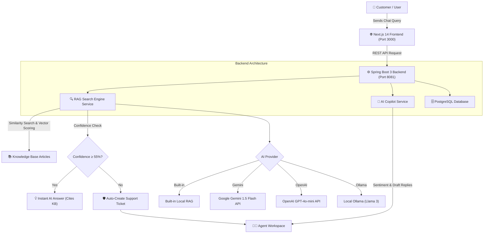

# 🤖 NexusAI Customer Support & Enterprise RAG Platform

> **An Intelligent AI-Powered Customer Support Automation System & Copilot Platform** built with **Spring Boot 3** and **Next.js 14**.

---

## 🌟 Overview & Why It's Easy to Use

NexusAI is designed to simplify customer support automation. It answers customer queries accurately using **Retrieval-Augmented Generation (RAG)** grounded in your company's Knowledge Base articles.

### ✨ Highlights
* **Zero Complex Setup**: Works out-of-the-box with a **Built-in RAG Engine** — no mandatory external API keys required!
* **Multi-AI Provider Support**: Easily switch between **Built-in RAG**, **Google Gemini**, **OpenAI**, or local **Ollama** models with a single configuration flag.
* **Automated Escalation Protection**: Low-confidence queries (<55%) automatically trigger live support ticket creation in PostgreSQL.
* **AI Copilot for Support Agents**: Assists human support agents by detecting customer sentiment (`FRUSTRATED`, `URGENT`, `NEUTRAL`), suggesting priorities, and drafting instant one-click replies.

---

## 📐 Architecture Overview



---

## 🛠️ Technology Stack

### 🔹 Frontend
* **Framework**: [Next.js 14](https://nextjs.org/) (App Router)
* **Library**: [React 18](https://react.dev/) & [TypeScript](https://www.typescriptlang.org/)
* **Styling**: [Tailwind CSS](https://tailwindcss.com/) (Vanilla CSS tokens & Glassmorphism)
* **Icons**: [Lucide React](https://lucide.dev/)
* **Analytics Charts**: [Recharts](https://recharts.org/)

### 🔹 Backend
* **Language**: Java 17 (JDK 17)
* **Framework**: [Spring Boot 3.2](https://spring.io/projects/spring-boot)
* **ORM & Database**: Spring Data JPA, Hibernate, PostgreSQL / H2
* **Build Tool**: Apache Maven (via Maven Wrapper `mvnw`)

---

## 🚀 Quick Start Guide (Easy Step-by-Step)

### Prerequisites
* **Java 17** (JDK 17 or higher)
* **Node.js 18+** & **npm**
* **PostgreSQL** running locally on port `5432` with database `support_db`

---

### 1️⃣ Step 1: Configure & Start the Backend

1. Navigate to the `backend` folder:
   ```bash
   cd backend
   ```

2. Configure environment variables in `backend/.env`:
   ```env
   SERVER_PORT=8081
   SPRING_DATASOURCE_URL=jdbc:postgresql://localhost:5432/support_db
   SPRING_DATASOURCE_USERNAME=postgres
   SPRING_DATASOURCE_PASSWORD=your_postgres_password
   
   # AI Provider Configuration (Options: builtin-rag, gemini, openai, ollama)
   AI_PROVIDER=gemini
   AI_API_KEY=your_gemini_api_key_here
   AI_MODEL=gemini-1.5-flash
   ```

3. Run the Spring Boot backend:
   ```bash
   # Windows PowerShell
   .\mvnw.cmd spring-boot:run
   
   # Mac / Linux
   ./mvnw spring-boot:run
   ```
   *The backend starts at `http://localhost:8081`.*

---

### 2️⃣ Step 2: Configure & Start the Frontend

1. Open a new terminal and navigate to the `frontend` folder:
   ```bash
   cd frontend
   ```

2. Verify `frontend/.env.local`:
   ```env
   NEXT_PUBLIC_API_URL=http://localhost:8081/api
   NEXT_PUBLIC_ENABLE_AI_WIDGET=true
   ```

3. Install dependencies and start the dev server:
   ```bash
   npm install
   npm run dev
   ```
   *The web application will open at `http://localhost:3000`.*

---

## 📡 REST API Reference

| Endpoint | Method | Description |
| :--- | :---: | :--- |
| `/api/knowledge-base` | `GET` | Fetch all published Knowledge Base articles |
| `/api/knowledge-base` | `POST` | Create a new Knowledge Base article |
| `/api/ai/chat` | `POST` | Process customer query through RAG engine & return answer with confidence score |
| `/api/ai/copilot/analyze/{ticketId}` | `GET` | Analyze support ticket (Sentiment, Priority, Draft Replies) |
| `/api/tickets` | `GET` | Retrieve all customer support tickets |
| `/api/tickets/{id}/status` | `PUT` | Update ticket status (`OPEN`, `IN_PROGRESS`, `RESOLVED`) |
| `/api/analytics/summary` | `GET` | Fetch system telemetry stats (Deflection Rate, CSAT, Resolution Time) |

---

## 💡 How It Works (User Journey Example)

1. **Asking a Question**:
   * A customer opens the **AI Customer Widget** and asks: *"How do I reset my password?"*.
   * The RAG engine scans the database, matches the article *"How to Reset Your Account Password"*, and returns a **98% Confidence** answer immediately.

2. **Automated Escalation**:
   * A customer asks an unrecognized question.
   * Confidence is below **55%**. The bot says *"Let me open a support ticket for an agent."* and logs a new ticket in PostgreSQL.

3. **Agent Resolution**:
   * A support agent opens the **Agent Workspace**.
   * AI Copilot highlights customer sentiment (e.g., `FRUSTRATED`), suggests priority (`HIGH`), and provides **1-click AI draft replies** to close the ticket in seconds.

---

## 📄 License
This project is open-source under the MIT License.
