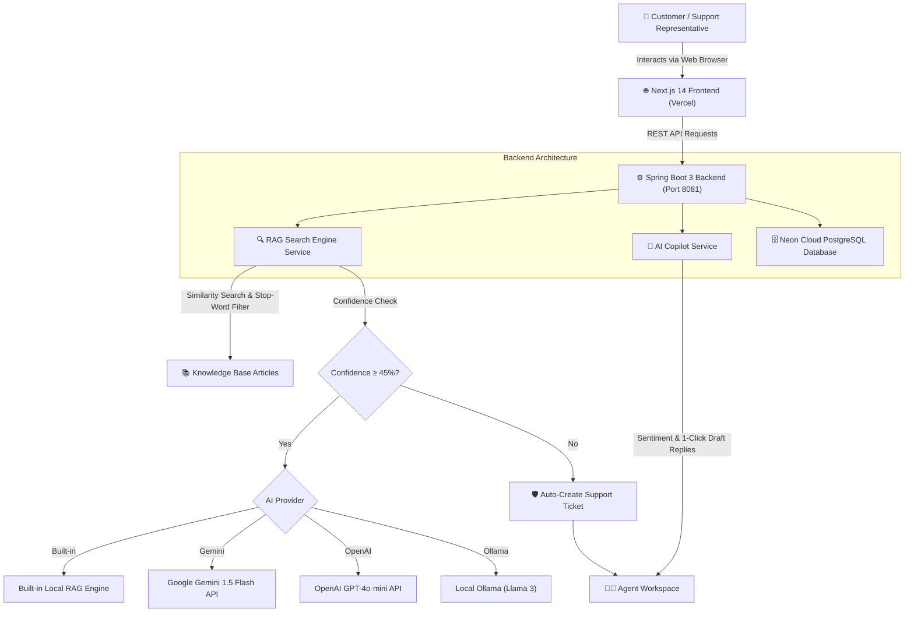

# 🤖 NexusAI Customer Support & Enterprise RAG Platform

> **An Intelligent AI-Powered Customer Support Automation System & Copilot Platform** built with **Spring Boot 3**, **Next.js 14**, and **Google Gemini AI**.

🌐 **Live Production Application**: [https://ai-customer-support-app-tawny.vercel.app](https://ai-customer-support-app-tawny.vercel.app/)  
📁 **GitHub Repository**: [https://github.com/Sivatheevan1224/ai-customer-support-app](https://github.com/Sivatheevan1224/ai-customer-support-app)

---

## 🌟 Overview & Why It's Easy to Use

NexusAI is designed to simplify and automate enterprise customer support. It answers customer queries accurately using **Retrieval-Augmented Generation (RAG)** grounded in your company's Knowledge Base articles.

### ✨ Highlights
* **Zero Complex Setup**: Works out-of-the-box with a **Built-in RAG Engine** — no mandatory external API keys required!
* **Multi-AI Provider Support**: Easily switch between **Built-in RAG**, **Google Gemini 1.5 Flash**, **OpenAI GPT-4o-mini**, or local **Ollama (Llama 3)** models with a single configuration flag.
* **Automated Escalation Protection**: Queries below 45% confidence automatically trigger support ticket creation for live human agents in PostgreSQL.
* **AI Copilot for Support Agents**: Assists human support agents by detecting customer sentiment (`FRUSTRATED`, `URGENT`, `NEUTRAL`), suggesting priorities, and drafting instant 1-click replies.
* **💬 Conversational Intent Handler**: Smart handling of general greetings, assistant identity, capabilities, and small talk with 95%–100% confidence.
* **💾 Chat History LocalStorage Persistence**: Preserves customer chat sessions across page reloads with a 1-click **Clear Chat** action.
* **🗑️ Complete Ticket & Article Deletion**: Full deletion options on ticket cards, article cards, and detailed modal views.
* **✨ Page Purpose & How to Use Banners**: Interactive, collapsible usage guides at the top of every dashboard page.

---

## 📐 System Architecture



---

## 🛠️ Technology Stack

### 🔹 Frontend
* **Framework**: [Next.js 14](https://nextjs.org/) (App Router)
* **Library**: [React 18](https://react.dev/) & [TypeScript](https://www.typescriptlang.org/)
* **Styling**: [Tailwind CSS](https://tailwindcss.com/) (Vanilla CSS tokens, Dark Mode & Glassmorphism)
* **Icons**: [Lucide React](https://lucide.dev/)
* **Analytics Charts**: [Recharts](https://recharts.org/)
* **Hosting**: [Vercel](https://vercel.com)

### 🔹 Backend
* **Language**: Java 17 (JDK 17)
* **Framework**: [Spring Boot 3.2](https://spring.io/projects/spring-boot)
* **AI Provider**: Google Gemini 1.5 Flash REST API
* **ORM & Database**: Spring Data JPA, Hibernate, [Neon Cloud PostgreSQL](https://neon.tech)
* **Build & Containerization**: Apache Maven Wrapper (`mvnw`), Docker, Docker Compose

---

## 🚀 Quick Start Guide (Easy Step-by-Step)

### Prerequisites
* **Java 17** (JDK 17 or higher)
* **Node.js 18+** & **npm**
* **PostgreSQL** (Local instance on port `5432` or Neon Cloud PostgreSQL)

---

### 1️⃣ Step 1: Configure & Start the Backend

1. Navigate to the `backend` folder:
   ```bash
   cd backend
   ```

2. Configure environment variables in `backend/.env`:
   ```env
   SERVER_PORT=8081
   SPRING_DATASOURCE_URL=jdbc:postgresql://ep-autumn-snow-ayfj4rci.c-5.us-east-2.aws.neon.tech/neondb?sslmode=require
   SPRING_DATASOURCE_USERNAME=neondb_owner
   SPRING_DATASOURCE_PASSWORD=npg_tGV0NfJYR2px
   
   # AI Provider Configuration (Options: builtin-rag, gemini, openai, ollama)
   AI_PROVIDER=gemini
   AI_API_KEY=your_gemini_api_key_here
   AI_MODEL=gemini-1.5-flash
   ```

3. Run the Spring Boot backend:
   ```bash
   # Windows PowerShell
   .\mvnw.cmd spring-boot:run
   
   # Mac / Linux
   ./mvnw spring-boot:run
   ```
   *The backend starts at `http://localhost:8081`.*

---

### 2️⃣ Step 2: Configure & Start the Frontend

1. Open a new terminal and navigate to the `frontend` folder:
   ```bash
   cd frontend
   ```

2. Verify `frontend/.env.local`:
   ```env
   NEXT_PUBLIC_API_URL=http://localhost:8081/api
   NEXT_PUBLIC_ENABLE_AI_WIDGET=true
   ```

3. Install dependencies and start the dev server:
   ```bash
   npm install
   npm run dev
   ```
   *The web application will open at `http://localhost:3000`.*

---

## 📡 REST API Reference

| Endpoint | Method | Description |
| :--- | :---: | :--- |
| `/api/knowledge-base` | `GET` | Fetch all published Knowledge Base articles |
| `/api/knowledge-base` | `POST` | Create a new Knowledge Base article |
| `/api/knowledge-base/{id}` | `PUT` | Update an existing Knowledge Base article |
| `/api/knowledge-base/{id}` | `DELETE` | Delete a Knowledge Base article |
| `/api/knowledge-base/{id}/vote` | `POST` | Register helpful/unhelpful vote on an article |
| `/api/ai/chat` | `POST` | Process customer query through RAG engine & return answer with confidence score |
| `/api/ai/copilot/analyze/{ticketId}` | `GET` | Analyze support ticket (Sentiment, Priority, Draft Replies) |
| `/api/tickets` | `GET` | Retrieve all customer support tickets |
| `/api/tickets` | `POST` | Create a new support ticket |
| `/api/tickets/{id}/status` | `PUT` | Update ticket status (`OPEN`, `IN_PROGRESS`, `RESOLVED`, `CLOSED`) |
| `/api/tickets/{id}` | `DELETE` | Delete a support ticket and its message history |
| `/api/analytics/summary` | `GET` | Fetch system telemetry stats (Deflection Rate, CSAT, Resolution Time) |

---

## 💡 How It Works (User Journey Examples)

1. **Asking a Question**:
   * A customer opens the **AI Customer Widget** and asks: *"How do I reset my password?"*.
   * The RAG engine scans the database, matches the article *"How to Reset Your Account Password"*, and returns a **98% Confidence** answer immediately.

2. **Automated Escalation**:
   * A customer asks an unrecognized complex issue.
   * Confidence is below **45%**. The bot says *"I couldn't find a direct match in our documentation. Let me connect you with a support representative."* and logs a new ticket in PostgreSQL.

3. **Agent Resolution & AI Copilot**:
   * A support agent opens the **Agent Workspace**.
   * AI Copilot highlights customer sentiment (e.g., `FRUSTRATED`), suggests priority (`HIGH`), and provides **1-click AI draft replies** to resolve the ticket in seconds.

---

## 📄 License
This project is open-source under the MIT License.
